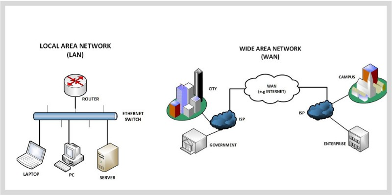

# 1.3 LAN과 WAN
네트워크는 접속할 수 있는 범위에 따라 LAN(Local Area Network)과 WAN(Wide Area Network)으로 나뉜다.

## LAN과 WAN
### LAN vs WAN
- LAN은 회사, 사무실, 집 등과 같이 물리적으로 제한되고 상대적으로 좁은 공간에서 컴퓨터들끼리 연결되어 있는 네트워크이다.
	- 컴퓨터가 2개만 연결되어 있어도 LAN이라고 할 수 있다.
- WAN은 **인터넷 서비스 제공자(ISP)로 연결**되어 있는 네트워크를 말한다.
	- LAN보다 물리적으로 거리가 더 먼 통신이 이루어질 수 있다.
	- LAN들이 모여 WAN을 이루었다고 생각해도 좋다.

- LAN은 물리적으로 거리가 짧기 때문에 WAN에 비해 통신의 속도가 빠르고 오류도 적게 나타난다. 하지만 WAN은 속도가 LAN에 비해 느린 편이며 오류도 더 많이 나타난다.

### ISP (Internet Service Provider)
- 인터넷 서비스를 제공하고 있는 통신 회사를 말한다.
	- KT, SKT, LG U+  

## 이번 장 정리
- 건물 안 같은 좁은 곳을 범위로 하는 네트워크를 LAN이라고 한다.
- ISP가 제공하는 서비스로 연결된 네트워크를 WAN이라고 하며, 상대적으로 LAN보다 더 넓은 거리에서 통신이 가능하다.
- LAN은 속도가 빠르고 오류가 적지만, WAN은 상대적으로 LAN보다 속도가 느리고 오류가 많다.