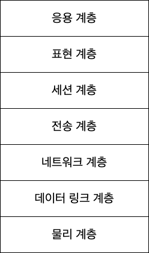
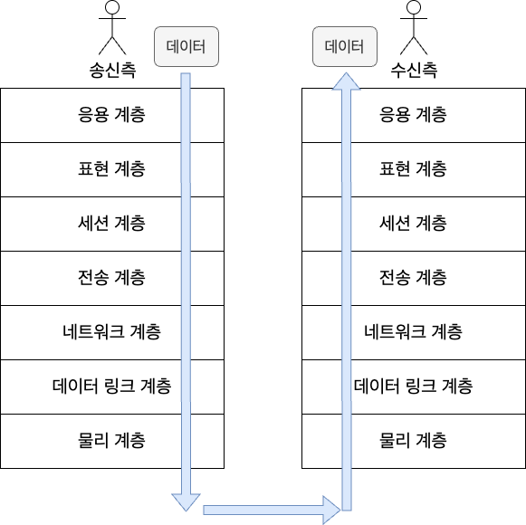
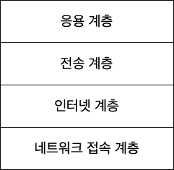
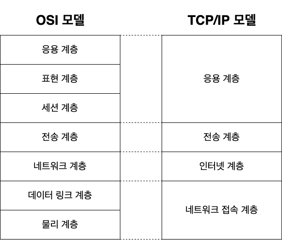

# 2.2 OSI 모델과 TCP/IP 모델
네트워크에서는 데이터를 주고받기위한 통신 규격이 정해져있다.

대표적으로 OSI 모델과 TCP/IP 모델이 있는데, 이에 대해 알아보도록 하자.

## OSI 모델
- 데이터가 전송되는 과정을 7계층으로 나눈 모델
- ISO(국제 표준화 기구)에서 제정하였다.

### 응용 계층 (Application Layer)
- OSI 모델의 7계층이다.
- 우리가 흔히 볼 수 있는 **프로그램이나 애플리케이션에 대한 서비스**에 관련된 계층을 말한다.
	- 가령 카카오톡에서 친구에게 "안녕"? 이라는 메시지를 입력해서 전송 버튼을 누르는 상황을 생각할 수 있다.
- 가장 사용자와 가까운 계층이다.

### 표현 계층 (Presentation Layer)
- OSI 모델의 6계층이다.
- 응용 계층으로부터 전달된 데이터에 대한 인코딩, 압축, 암호화 등의 **데이터 변환** 작업을 담당한다.

### 세션 계층 (Session Layer)
- OSI 모델의 5계층이다.
- 통신을 위한 **세션 체결**과 **통신 방식 결정**을 한다.

### 전송 계층 (Transport Layer)
- OSI 모델의 4계층이다.
- **신뢰할 수 있는 통신**을 구현하는 역할을 한다.

### 네트워크 계층 (Network Layer)
- OSI 모델의 3계층이다.
- 수신측과 통신하기 위한 **경로 설정**과 **논리적 주소 결정**의 역할을 한다.

### 데이터 링크 계층 (Data Link Layer)
- OSI 모델의 2계층이다.
- 네트워크 기기간의 **데이터 전송** 및 **물리 주소 결정**을 담당한다.

### 물리 계층 (Plysical Layer)
- OSI 모델의 1계층이다.
- 시스템간의 **물리적인 연결**과 **전기 신호 변환**에 관련된 계층이다.

### 어떻게 동작하는가?
- 송신측에서 데이터 전송을 시작하면 7계층부터 1계층까지 데이터에 대해 각자의 기능을 한다. 그 다음 송신측에서는 반대로 그 데이터를 1계층부터 7계층까지 순서대로 데이터에 대한 해석을하여 수신측에 완전히 도착하게 된다.

- 각 계층은 독립적이기 때문에, 데이터가 전송되는 동안에 서로에게 영향을 주거나 받지 않는다.

## TCP/IP 모델
OSI 모델이 근본적인 모델이라고 할 수 있지만, 요즘에는 OSI 모델에서 더 간략화된 **TCP/IP** 모델을 많이 다룬다.

- TCP/IP 모델은 4개의 계층(응용 계층, 전송 계층, 인터넷 계층, 네트워크 접속 계층)으로 나뉘어져 있다.

- OSI 모델로부터 매핑되는 계층은 다음과 같다.

- 각 계층에는 다양한 프로토콜이 존재한다.

## 이번 장 정리
- OSI 모델은 국제 표준화 기구에서 제정한 통신 규격 모델이다. 응용 계층, 표현 계층, 세션 계층, 전송 계층, 네트워크 계층, 데이터 링크 계층, 물리 계층으로 이루어져 있다.
- TCP/IP 모델은 OSI 모델을 간략화한 모델이다. 오늘날에는 TCP/IP 모델을 사용하고 있다.