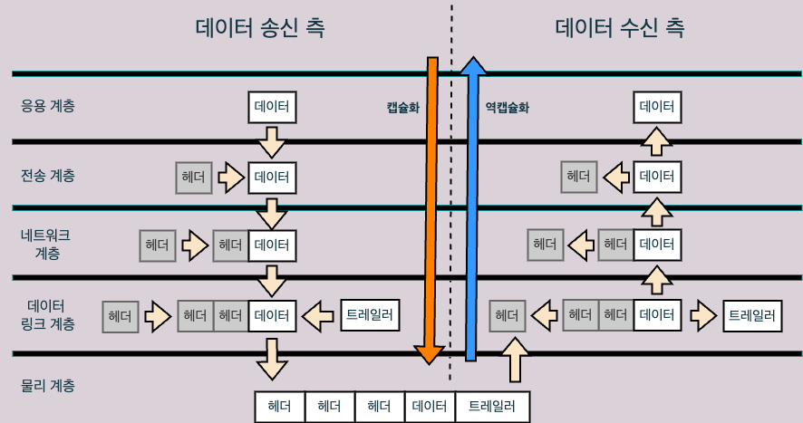

# 2.3 캡슐화와 역캡슐화

## 캡슐화와 역캡슐화란
- 데이터를 전송할때 현재의 계층에서 정보를 덧붙여 다음 계층으로 보내게 되는데, 이 덧붙여지는 정보를 **헤더**라고 한다.
- 헤더를 붙여나가는 과정을 **캡슐화**라고 하고, 반대로 헤더를 제거해나가는 과정을 **역캡슐화**라고 한다.

- 데이터 송신측 계층에서는 각각의 계층마다 수행되는 정보에 대한 헤더가 차례차례 붙게 되고, 데이터 수신측에서는 반대로 헤더를 하나하나 제거함으로써 최종 데이터를 얻어낸다.
- **트레일러**는 데이터를 전달할때 **데이터의 마지막에 추가하는 정보**를 말한다.  

## 이번 장 정리
- 데이터를 전송할때는 필요한 정보를 데이터에 추가해야 하는데 이 정보를 헤더라고 한다.
- 데이터를 상대방에게 보낼 때 각 계층에서 헤더(마지막에 붙는 트레일러 포함)를 붙여나가는 과정을 캡슐화라고 한다.
	- 반대로 제거해나가는 과정을 역캡슐화라고 한다.
- OSI 모델에서는 데이터 송신 측은 응용 계층 -> 전송 계층 -> 네트워크 계층 -> 데이터 링크 계층 순서로 캡슐화한다. 반대로 수신 측에서는 데이터 링크 계층 -> 네트워크 계층 -> 전송 계층 -> 응용 계층 순서로 역캡슐화한다.
- 송신 측의 데이터 링크 계층에서 만들어진 데이터가 전기 신호로 변환되어 수신 측에 전송된다.