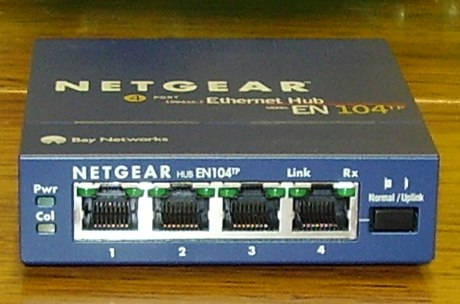
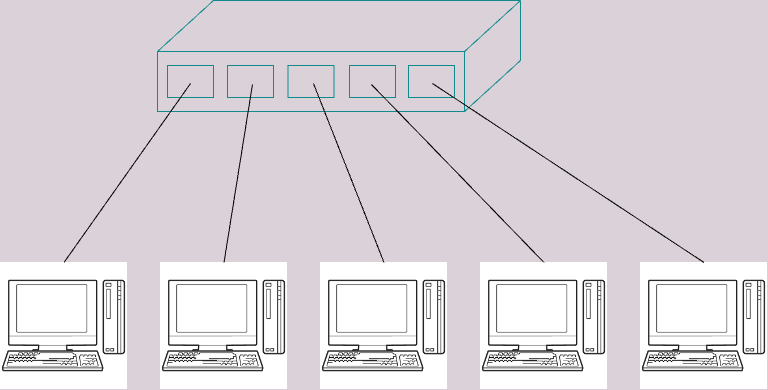
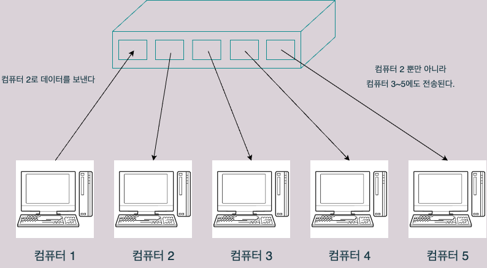

# 3.3 리피터와 허브의 구조

물리계층에서 동작하는 리피터와 허브에 대해 알아보자.

## 리피터란?
- 리피터(repeater)는 전기신호를 **정형하고 증폭**하는 기능을 가진 네트워크 **중계** 장비이다.
	- 정형: 일그러진 전기 신로를 변경

- 통신할때 수신측에 먼 곳에 있다면 그 과정에서 노이즈의 영향으로 전기신호가 일그러지거나 약해지는 현상이 발생할 수 있다. 그래서 그 사이에 리피터를 둠으로써 전기신호가 정상적으로 변환되어 전송될 수 있도록 한다.

- 요즘에는 다른 네트워크 장비가 리피터의 기능을 대신하기 때문에 보기가 힘들다. 앞으로도 사용할 일이 드물 것이라고 한다.
	- 그래도 리피터라는 네트워크 장비가 있었다는 것을 알아두면 좋다.

## 허브란?
- 허브(hub)는 포트(통신할 수 있는 통로)를 여러개 가지고 있어, 일대일 통신에 국한되지 않고 여러 기기와 통신할 수 있게 해준다. 
- 리피터와 마찬가지로 전기 신호를 정형하고 증폭하는 기능도 한다.

- 포트가 여러개 있기 때문에 여러개의 컴퓨터를 연결할 수 있다.
	- 랜 케이블을 이용한다.

- 아래와 같이 여러 컴퓨터를 서로 연결하는 장치로 사용될 수도 있다.

- 허브는 특정 포트로 데이터를 받는다면 다른 포토로도 모두 데이터를 전송한다는 특징이 있다. 
	- 만약 컴퓨터 1에서 컴퓨터 2로 데이터를 전송하면, 그 데이터는 컴퓨터 3 ~ 5까지 모두 전송된다.

- 이처럼 허브는 전기 신호를 보낼 곳을 판단하는 것이 아니라, 연결되어있는 모든 포트로 전송하기 때문에 **더미 허브 (dummy hub)**라는 이름으로 불리기도 한다.
	- 이런 단점이 있으면 다른 곳으로 불필요한 데이터가 전송되는 것이기 때문에 좋지 않다.
	- 그래서 이를 보완하기 위해 생긴 것이 스위치다. 스위치는 4단원에서 알아보기로 한다.

## 이번 장 정리
- 리피터는 네트워크를 중계(전기 신호를 정형하고 증폭)하는 장비이다.
- 허브도 마찬가지로 네트워크를 중계하는데, 일대일 통신에 국한되지 않고 포트를 통해 여러 컴퓨터와 통신할 수 있게 해준다.
- 허브는 통신시 어디로 전송해야 하는지 스스로 판단하지 못하기 때문에 '더미 허브'라고도 불린다.