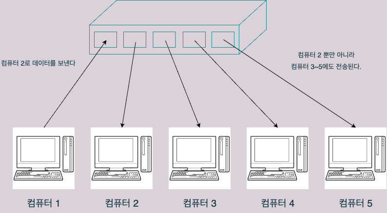

# 4.1 데이터 링크 계층의 역할과 이더넷

## 데이터 링크 계층의 역할
- 데이터 링크 계층은 **LAN에서 네트워크 장비 간의 통신 규칙을 정하는** 계층이다.
- 통신 규칙 중 가장 일반적으로 사용되는 것이 **이더넷(Ethernet)** 이다.

## 이더넷 (Ethernet)
- 이더넷에서 정한 규칙의 예시를 알아보도록 하자.

### 데이터 전송시 목적지 정보를 함께 전송
- LAN에서 컴퓨터들이 허브에 연결되어 있는 구조라고 해보자. 
	- 이 경우 3단원 물리계층에서 알아봤다시피, 특정 포트에 연결된 컴퓨터에서 다른 포트로 연결된 컴퓨터로 데이터를 전송한다면, 그 신호는 허브의 포트와 연결된 모든 컴퓨터에 전송된다.
		- 이것은 의도하지 않은 목적지에 불필요한 데이터가 전송된다는 단점이 있다.

 

- 하지만 이더넷에서는 **데이터 전송시 목적지 정보를 함께 전송**함으로써, **데이터를 받은 컴퓨터가 목적지 정보와 다르다면 데이터를 무시해버린다**는 규칙을 정하고 있다.

### 데이터 충돌 방지 (CSMA/CD)
- LAN에서 여러 컴퓨터가 동시에 데이터를 전송하게 되면, 케이블에서 데이터간 충돌이 발생할 수 있다.

- 이러한 문제를 CSMA/CD 라는 방법으로 해결한다.
	- CSMA/CD 란?
		- 케이블에 데이터가 흐르고 있으면 잠시 대기하다가, 해당 데이터 전송이 완료되면 전송하는 방식
		- CS: `"데이터를 전송하려고 하는 컴퓨터가 케이블에 신호가 흐르고 있는지 확인한다"`
		- MA: `"케이블에 데이터가 흐르고 있지 않다면 전송해도 좋다"`
		- CD: `"충돌이 발생하고 있는지 확인한다"`

- 하지만 지금은 CSMA/CD가 비효율적이라는 이유로 거의 쓰이지 않는다.
	- 대신 이 역할을 **스위치**가 대신하는데, 이는 4.3장에서 자세히 알아보도록 하자.

## 이번 장 정리
- 데이터 링크 계층은 LAN에서 네트워크 장비 간 통신 규칙을 정하는 계층이다.
- 그 규칙중 가장 많이 사용되는 것이 이더넷(Ethernet)이다.
- 이더넷은 데이터 전송시 목적지 정보를 함께 전송하여 불필요한 곳으로 데이터가 전송되지 않게 하고, CSMA/CD라는 규칙이 있어 데이터의 충돌을 방지한다.
- CS는 케이블에 신호가 흐르고 있는지 확인, MA는 케이블에 신호가 흐르고 있지 않다면 전송, CD는 케이블에서 데이터의 충돌이 발생하는지 확인한다는 의미이다.
- CSMA/CD는 비효율적인 방식이라 지금은 거의 쓰이지 않고, 그 역할을 스위치가 대신하고 있다.