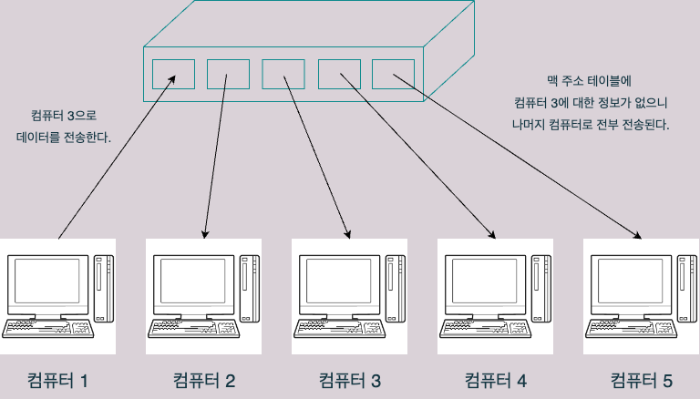

# 4.3 스위치의 구조

## 스위치
- 데이터 링크 계층에서 동작하는 장비
- **레이어 2 스위치** 또는 **스위칭 허브** 라고도 불린다.
- 생김새가 허브와 매우 유사하다.

## MAC 주소 테이블 
- 스위치에는 MAC 주소 테이블(MAC address table)이라는 것이 있다.
- 스위칭 허브에 있는 각각의 포트와 그 포트에 연결되어 있는 컴퓨터의 MAC 주소를 매핑시켜놓은 테이블이다.

### 어떻게 동작하는가
- 스위치에 총 5개의 포트가 있고, 모든 포트에 컴퓨터들이 연결되어 있다고 해보자.
	- 포트 1~5가 있고, 포트 n에는 컴퓨터 n이 연결되어있다고 하자.
- 스위치 전원을 켜면 MAC 주소 테이블에는 아래와 같이 MAC 주소에 대한 아무런 데이터가 존재하지 않는다.

#### 컴퓨터 1에서 컴퓨터 3으로 데이터를 전송한다고 가정해보자

- 스위치는 포트1에서 넘어온 프레임(컴퓨터 1에서 전송한 프레임)에서 **출발지 MAC 주소**를 확인하고, 테이블에 없다면 추가한다. 이것을 **MAC 주소 학습 기능** 이라고 한다.
	- MAC 주소 학습 기능은 허브에는 없는 기능이다.

- 그러나 테이블에 목적지 컴퓨터에 대한 정보가 없기 때문에, 송신 컴퓨터(컴퓨터 1)을 제외한 2, 3, 4, 5에 전부 데이터를 전송한다. 이를 **플러딩**이라고 한다. 

- 만약 목적지 컴퓨터에 대한 정보가 MAC 주소 테이블에 존재한다면, 다른 컴퓨터에는 전송되지 않고 오로지 목적지 컴퓨터에만 데이터가 전송된다. 이를 **MAC 주소 필터링** 이라고 한다.

### 이번 장 정리
- 스위치는 데이터 링크 계층에서 동작하며, 레이어 2 스위치 또는 스위칭 허브라고 불린다.
- 스위치에는 내부에 MAC 주소 테이블이 있다.
- 송신 컴퓨터에서 보낸 프레임을 보고 MAC 주소 테이블에 해당 포트의 MAC 주소를 저장하는 것을 MAC 주소 학습 기능 이라고 한다.
- 스위치가 수신 포트 이외의 모든 포트에 데이터를 송신하는 것을 플러딩 이라고 한다.
- 스위치가 MAC 주소 테이블을 보고 목적지 컴퓨터를 특정하여 데이터를 송신하는 것을 MAC 주소 필터링 이라고 한다.