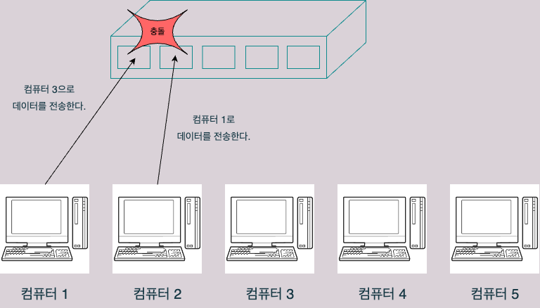
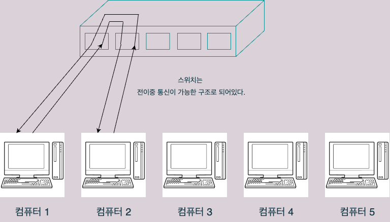

# 4.4 데이터가 케이블에서 충돌하지 않는 구조

## 전이중 통신과 반이중 통신
### 전이중 통신
- 데이터의 송수신을 동시에 할 수 있는 통신
- 데이터를 동시에 전송해도 충돌이 발생하지 않는다.

### 반이중 통신
- 송수신을 동시에 할 수 없고 회선 하나로 송신과 수신을 번갈아가며 하는 형태의 통신
- 데이터를 동시에 전송하면 충돌이 발생한다.
	- 충돌이 발생하면 네트워크 지연이 발생한다.

## 예시
- 만약 컴퓨터 1과 컴퓨터 2를 랜 케이블로 연결했다면, 크로스 케이블에 있는 선(1, 2, 3, 6번 선) 끼리는 데이터를 동시에 전송해도 문제가 없다. 따라서 이것은 전이중 통신에 해당한다.

- 일반 허브의 경우, 만약 포트 1에는 컴퓨터 1이 연결되어있고 포트 2에는 컴퓨터 2가 연결되어 있다고 할 때, 동시에 서로 데이터를 보내게 되면 충돌이 일어난다. 이것은 반이중 통신에 해당한다.

- 스위치는 허브와 다르게 내부적으로 전이중 통신이 가능한 구조로 되어있다.
	- 그래서 요즘에는 네트워크 업체 대부분이 허브를 팔지 않고 스위치를 판다.

## 충돌 도메인
- 데이터 전송시 충돌이 발생하게 되면 그 영향이 미치게되는 범위를 **충돌 도메인(collistion domain)**이라고 한다.
- 허브의 경우에는 특정 컴퓨터끼리 통신시 충돌이 발생하면 허브와 연결되어 있는 모든 컴퓨터에 영향이 간다. 따라서 허브의 충돌 도메인은 허브와 연결되어 있는 모든 컴퓨터가 된다.
- 스위치는 전이중 통신 방식이라 충돌이 일어나지 않을 뿐더러, 충돌 도메인도 모든 컴퓨터가 아니라 더 좁다.

### 이번 장 정리
- 전이중 통신은 데이터의 송수신을 동시에 할 수 있어 충돌이 일어나지 않는 통신 방식이다.
- 반이중 통신은 데이터의 송수닌을 동시에 하게되면 충돌이 발생하며, 번갈아 통신해야하는 방식이다.
- 데이터 충돌이 발생하면 네트워크 지연이 발생하고, 그 영향이 미치는 범위를 충돌 도메인이라고 한다.